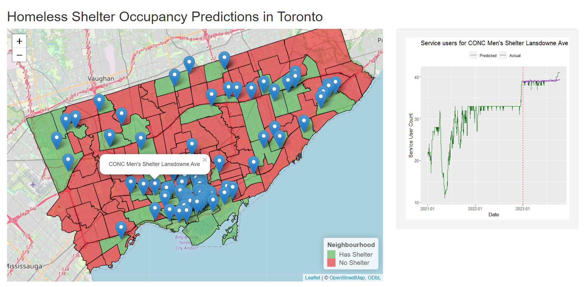
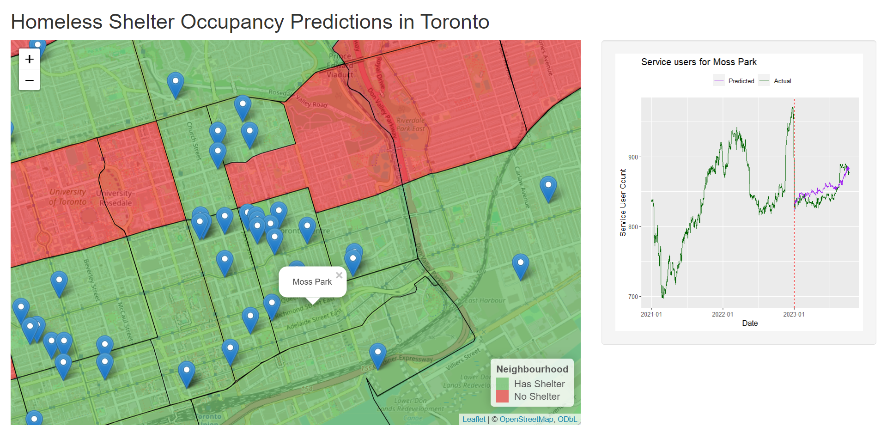

## Map Visualization

To visualize the predicted shelter user counts, we built a Shiny app using R which includes an interactive map of Toronto shelters and neighbourhoods and a sidebar panel which shows the time series forecast for the selected shelter/neighbourhood. We found that the Random Forest model captures the general trend for most shelters, however there are sometimes unforeseen factors (e.g. capacity changes) that are unique to each shelter. Thus, our model can be used as a starting point for planning decisions and further investigation can be done into the specific shelter/neighbourhood to account for unseen factors in our model.

The code to run the Shiny app can be found in `map_visualization.R`.

*Figure 1: Shiny App showing a selected shelter*

*Figure 2: Shiny App showing a selected neighbourhood*
